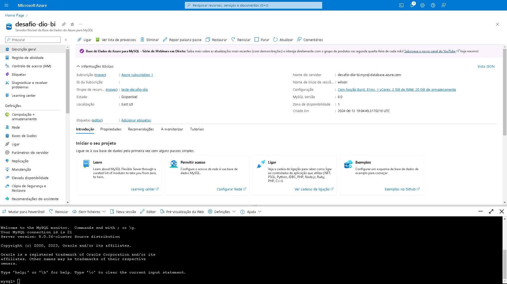
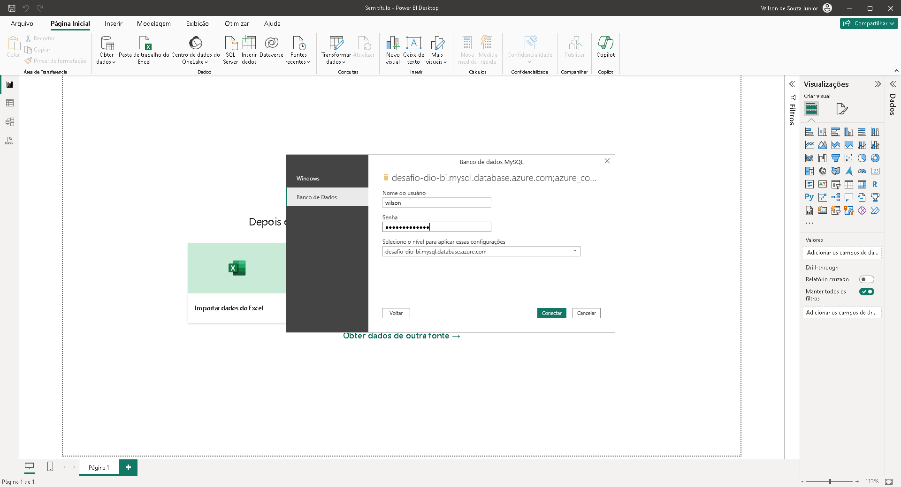
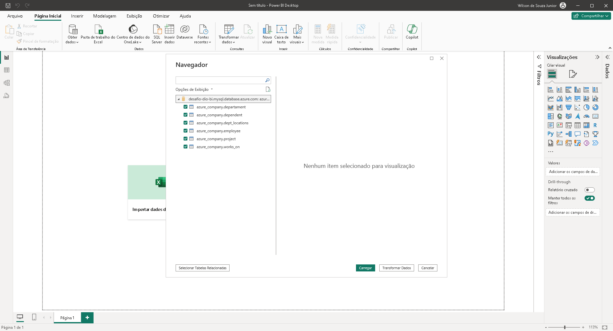
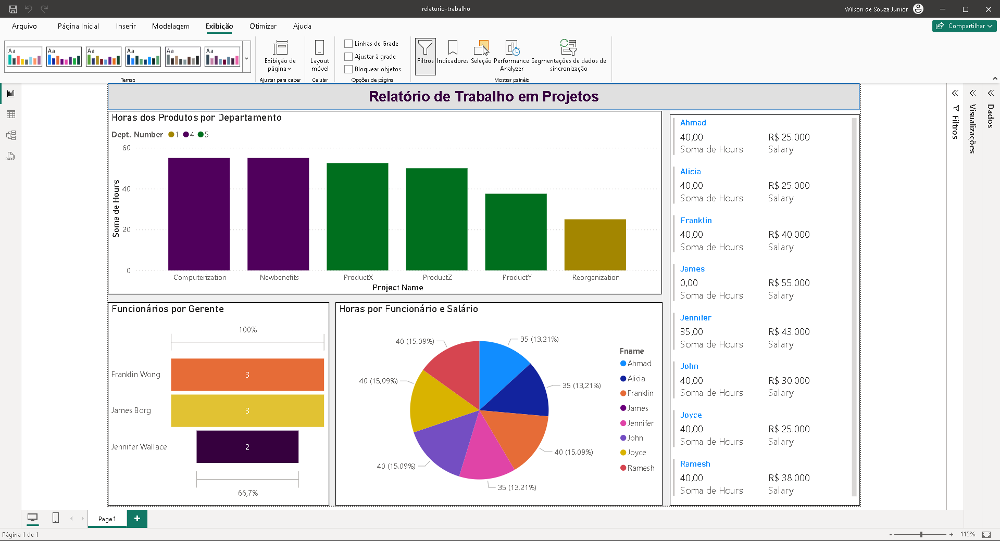

# Dashboard e Relatório - Sales Report

## 📒 Descrição
Segundo material construído utilizando Power BI, utilizando BD do Azure. Demonstra de maneira simples algumas informações extraídas de um dataset, após este ser criado, populado e sofrido algumas limpezas e reestruturações.
As informações são sobre horas trabalhadas por funcionários. E horas gastas em produtos por determinados departamentos.

## 🔎 Saiba Mais
- Material desenvolvido com o objetivo de concluir um desafio na plataforma de estudos [dio.me](https://web.dio.me)
- Não contém layout para display mobile.

## 💻 Ferramentas utilizadas
- [Azure](https://portal.azure.com/) - Para criação e população de um Banco de Dados, assim como para permitir o acesso a este.
- [MySQL](https://www.mysql.com/) - Para alteração necessária em alguns comandos
- [Power BI Desktop](https://www.microsoft.com/pt-br/download/details.aspx?id=58494) - Para utilização do dataset e criação do relatório

## ✨ Features
- Criação e população do banco de dados na nuvem
- Limpeza e reestruturação do banco de dados
- Utilização do banco de dados para a criação de um simples relatório
- Primeira página contendo visuais sobre horas trabalhadas por funcionário. E horas gastas dos departamentos sobre vários produtos.
- Outras informações como: Quantidade de funcionários sob gerentes e uma lista de horas trabalhadas e o salário de determinados funcionários.

## 📚 Referências
- [GitHub Juliana Mascarenhas](https://github.com/julianazanelatto) - Para obtenção de outros dataset para fins didáticos.
