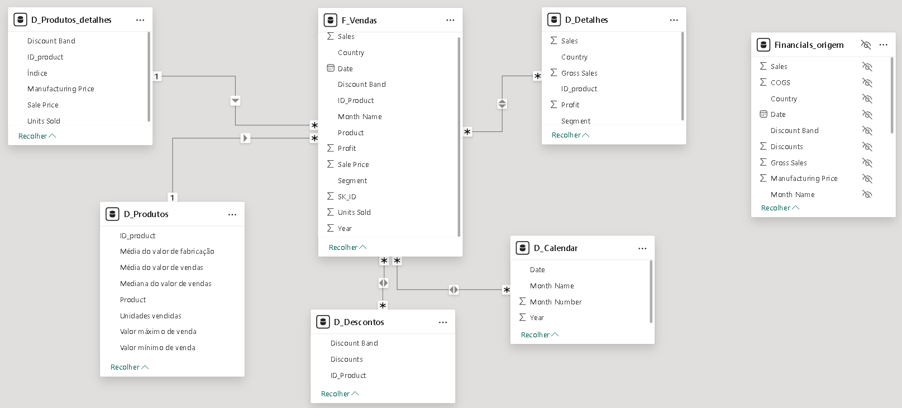

# Modelando um Dashboard de E-commerce

## 📒 Descrição
📊 Análise da Estrutura de Dados no Power BI

Modelo de dados no Power BI, composto por várias tabelas interconectadas.
Esquema de modelagem dimensional no estilo **Star Schema**, muito utilizado em `Data Warehousing` para facilitar a consulta de dados. No caso, esse modelo está relacionado à **área de vendas e produtos**

---

### 🔢 Tabelas Fato:

1. F_Vendas (Fato de Vendas)
   - Tabela central do modelo
   - Contém métricas como Sales, Profit, Units Sold
   - Conectada a várias dimensões

2. Financials_origem
   - Parece ser uma tabela de origem financeira
   - Inclui métricas como Sales, COGS, Gross Sales

---

### 🧩 Tabelas Dimensão:

1. D_Produtos_detalhes
   - Detalhes específicos dos produtos
   - Campos: `ID_product, Manufacturing Price, Sale Price`

2. D_Produtos
   - Informações gerais sobre produtos
   - Inclui médias e medianas de valores de venda

3. D_Detalhes
   - Detalhes adicionais, possivelmente um sumário
   - Contém `Sales, Gross Sales, Profit por país e segmento`

4. D_Descontos
   - Informações sobre descontos aplicados
   - Campos: `Discount Band, Discounts, ID_Product`

5. D_Calendar
   - Dimensão de tempo
   - Campos: `Date, Month Name, Month Number, Year`

---

### 🔹 Fato vs. Dimensão

O esquema apresentado segue a estrutura básica de uma tabela fato cercada por tabelas dimensão. A tabela fato contém dados quantitativos (como vendas ou lucros), enquanto as tabelas dimensão possuem os detalhes qualitativos que explicam esses dados.

---

### 🔗 Relacionamentos:

- F_Vendas está no centro, conectada às demais tabelas
- Relacionamentos 1:* (**um para muitos**) entre dimensões e fato
- Chaves de ligação incluem `ID_Product, Date, Discount Band`

---

### 🛠️ Criação do Modelo:

1. Importação de Dados:
   - Carregar tabelas de diferentes fontes (ex: SQL, Excel)

2. Modelagem:
   - Definir F_Vendas como tabela de fatos central
   - Criar tabelas de dimensão para análises específicas

3. Relacionamentos:
   - Estabelecer conexões entre F_Vendas e dimensões
   - Usar chaves como ID_Product para ligações

4. Medidas e Cálculos:
   - Criar medidas em F_Vendas (ex: Total Sales, Profit)
   - Desenvolver cálculos em D_Produtos (ex: Média de vendas)

5. Otimização:
   - Ajustar tipos de dados e formatos
   - Implementar hierarquias (ex: Ano > Mês em D_Calendar)

### 🎯 Objetivo do Modelo:
Este modelo permite análises detalhadas de vendas, incluindo:
- Desempenho por produto, país e segmento
- Análises temporais (tendências mensais/anuais)
- Impacto de descontos nas vendas e lucros

---

### 💡 Conclusão:
O modelo apresenta uma estrutura para análises comerciais abrangentes, permitindo explorações multidimensionais dos dados de vendas.
Essa abordagem `Star Schema` é ideal para **Business Intelligence** devido à sua simplicidade e eficiência em consultas.

---

## 📒 Código e Diagrama
Código utilizando SQL e seu consequente diagrama

---

 ### 💻 [Código](assets/documents/diagrama.sql)

 ```sql
-- Tabela D_Produtos_detalhes
CREATE TABLE D_Produtos_detalhes (
    ID_product INT PRIMARY KEY,
    Discount_Band VARCHAR(50),
    Indice INT,
    Manufacturing_Price DECIMAL(18,2),
    Sale_Price DECIMAL(18,2),
    Units_Sold INT
);

-- Tabela D_Produtos
CREATE TABLE D_Produtos (
    ID_product INT PRIMARY KEY,
    Product VARCHAR(100),
    Media_valor_fabricacao DECIMAL(18,2),
    Media_valor_vendas DECIMAL(18,2),
    Mediana_valor_vendas DECIMAL(18,2),
    Unidades_vendidas INT,
    Valor_maximo_venda DECIMAL(18,2),
    Valor_minimo_venda DECIMAL(18,2)
);

-- Tabela F_Vendas (Fato)
CREATE TABLE F_Vendas (
    ID INT PRIMARY KEY,
    Date DATE,
    ID_Product INT,
    Country VARCHAR(50),
    Discount_Band VARCHAR(50),
    Product VARCHAR(100),
    Segment VARCHAR(50),
    Month_Name VARCHAR(20),
    Year INT,
    Sales DECIMAL(18,2),
    Profit DECIMAL(18,2),
    Sale_Price DECIMAL(18,2),
    Units_Sold INT,
    SK_ID INT
);

-- Tabela D_Detalhes
CREATE TABLE D_Detalhes (
    ID INT PRIMARY KEY,
    Country VARCHAR(50),
    ID_product INT,
    Segment VARCHAR(50),
    Sales DECIMAL(18,2),
    Gross_Sales DECIMAL(18,2),
    Profit DECIMAL(18,2)
);

-- Tabela D_Descontos
CREATE TABLE D_Descontos (
    ID INT PRIMARY KEY,
    Discount_Band VARCHAR(50),
    Discounts DECIMAL(18,2),
    ID_Product INT
);

-- Tabela D_Calendar
CREATE TABLE D_Calendar (
    Date DATE PRIMARY KEY,
    Month_Name VARCHAR(20),
    Month_Number INT,
    Year INT
);

-- Tabela Financials_origem
CREATE TABLE Financials_origem (
    ID INT PRIMARY KEY,
    Date DATE,
    Country VARCHAR(50),
    Discount_Band VARCHAR(50),
    Month_Name VARCHAR(20),
    Sales DECIMAL(18,2),
    COGS DECIMAL(18,2),
    Gross_Sales DECIMAL(18,2),
    Manufacturing_Price DECIMAL(18,2),
    Discounts DECIMAL(18,2)
);

-- Relacionamentos entre as tabelas

-- Relacionamento entre F_Vendas e D_Produtos (ID_Product)
ALTER TABLE F_Vendas
ADD FOREIGN KEY (ID_Product) REFERENCES D_Produtos(ID_product);

-- Relacionamento entre F_Vendas e D_Calendar (Date)
ALTER TABLE F_Vendas
ADD FOREIGN KEY (Date) REFERENCES D_Calendar(Date);

-- Relacionamento entre F_Vendas e D_Descontos (Discount_Band)
ALTER TABLE F_Vendas
ADD FOREIGN KEY (Discount_Band) REFERENCES D_Descontos(Discount_Band);

-- Relacionamento entre D_Detalhes e D_Produtos (ID_product)
ALTER TABLE D_Detalhes
ADD FOREIGN KEY (ID_product) REFERENCES D_Produtos(ID_product);

-- Relacionamento entre D_Descontos e D_Produtos (ID_Product)
ALTER TABLE D_Descontos
ADD FOREIGN KEY (ID_Product) REFERENCES D_Produtos(ID_product);
 ```

---

 ### 🔍 [Diagrama](assets/images/diagrama.png)


## 🔎 Saiba Mais
- Material desenvolvido com o objetivo de concluir um desafio na plataforma de estudos [dio.me](https://web.dio.me)

## 🔨 Ferramentas utilizadas
- [MySQL](https://www.mysql.com/) - Para desenvolvimento do código e criação do diagrama
- [dbdiagram](https://dbdiagram.io/) - Solução alternativa para desenvolvimento do código e criação do diagrama (online - não necessita instalação)

## 📚 Referências
- [GitHub Juliana Mascarenhas](https://github.com/julianazanelatto) - Para obtenção de outros dataset para fins didáticos.