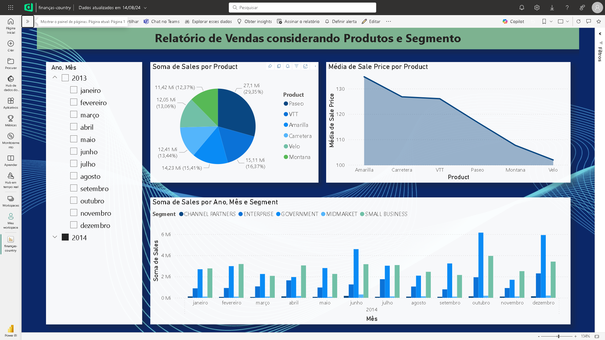
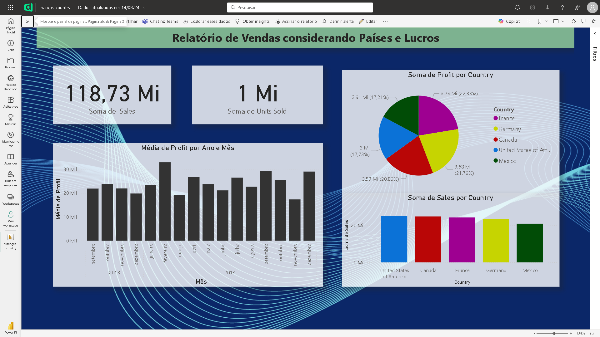
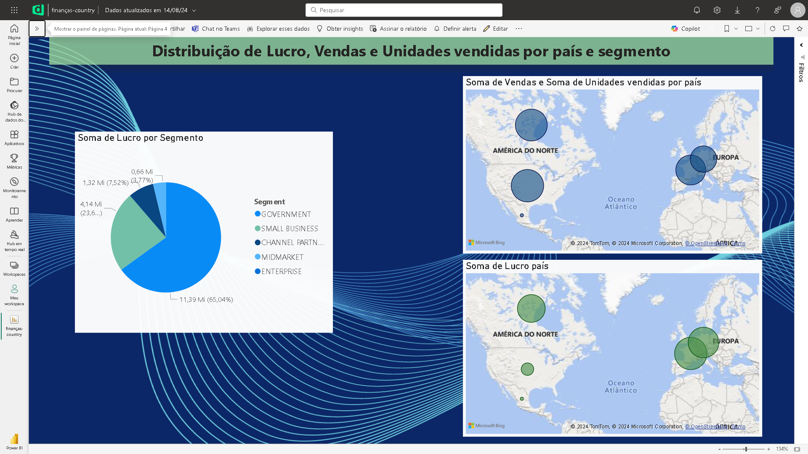

# Dashboard e Relatório - Financial Report

## 📒 Descrição
Terceiro material construído utilizando Power BI. Demonstra de maneira simples algumas informações extraídas de um dataset de exemplo disponibilizado pela própria plataforma.
As informações são sobre vendas e lucros obtidos sobre principais produtos vendidos em diversas regiões geográficas, em um determinado período de tempo.

## 🔎 Saiba Mais
- Material desenvolvido com o objetivo de concluir um desafio na plataforma de estudos [dio.me](https://web.dio.me)
- Não contém layout para display mobile.

## 💻 Ferramentas utilizadas
- [Power BI Desktop](https://www.microsoft.com/pt-br/download/details.aspx?id=58494) - Para utilização do dataset e criação do dashboard
- [Power BI Service](https://app.powerbi.com/) - Para publicação do material final

## ✨ Features
- Primeira página contendo visuais sobre vendas por segmento, produtos e período
- Diversos botões interativos para alterar determinados visuais nos espaços de vendas por segmento e produtos.
- Segunda página contendo visuais sobre vendas lucros por países e lucros em determinados meses e anos
- Diversos botões interativos para alterar determinados visuais nos espaços de vendas e lucros
- Terceira página contendo visuais sobre a distribuição de lucros, vendas e unidades vwendidas por regiões geográficas
- Diversos botões interativos para alterar determinados visuais nos espaços de lucros por segmento em variados países

## 📚 Referências
- [GitHub Juliana Mascarenhas](https://github.com/julianazanelatto) - Para obtenção de outros dataset para fins didáticos.
