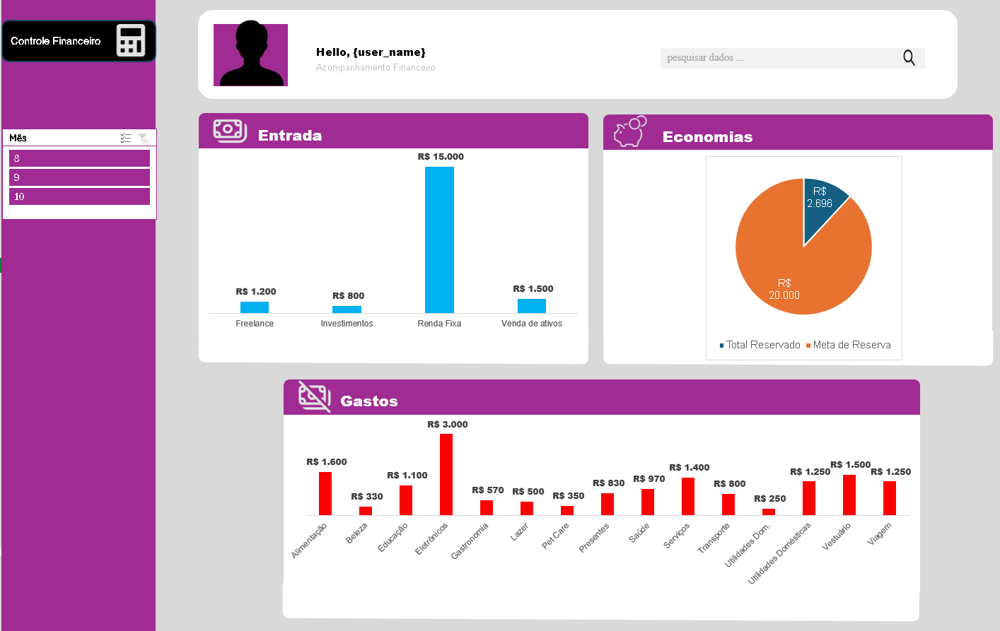

# Controle Financeiro - Planilha Dinâmica🧾💰

Bem-vindo ao repositório do projeto **Controle Financeiro**! Este repositório contém uma planilha Excel interativa e poderosa para organizar, monitorar e analisar suas finanças. Aqui você encontrará detalhes sobre o funcionamento e os recursos disponíveis na planilha.

---

## 💻 Estrutura do Arquivo

A planilha está organizada em várias abas para atender diferentes aspectos do gerenciamento financeiro. Abaixo está uma explicação detalhada de cada aba:

### 1. **Dashboard** 📊

A aba **Dashboard** é o centro visual do seu acompanhamento financeiro. Com um design interativo e gráficos dinâmicos, ela fornece uma visão geral do seu fluxo de caixa. 

#### Elementos:
- **Entrada:** Um gráfico de barras destacando suas fontes de receita como Freelance, Investimentos, Renda Fixa e Venda de Ativos.
- **Economias:** Um gráfico de pizza mostrando a meta de reserva e o valor já reservado.
- **Gastos:** Um gráfico de barras categorizando despesas em Alimentação, Beleza, Eletrônicos, Saúde, e mais.
- **Filtros:** Um painel lateral para selecionar o mês que deseja analisar.

> Confira um exemplo visual abaixo:

---

### 2. **Receitas** 💵

Registre todas as entradas financeiras, categorizando por tipo de renda e data.

- **Colunas:** Data, Descrição, Categoria, Valor.
- **Funcionalidades:**
  - Validação de dados para evitar duplicidades.
  - Totalizador automático de receitas por mês.

---

### 3. **Despesas** 💳

Organize suas despesas com detalhamento por categoria e data.

- **Colunas:** Data, Descrição, Categoria, Valor.
- **Funcionalidades:**
  - Sistema de categorias pré-definidas (e.g., Alimentação, Saúde).
  - Cálculo automático do total mensal.

---

### 4. **Resumo Mensal** 🗓️

Oferece uma visão consolidada das finanças mensais.

- **Colunas:** Mês, Total de Receitas, Total de Despesas, Saldo Final.
- **Funcionalidades:**
  - Indicadores visuais para saldo positivo/negativo.
  - Comparação percentual entre meses.

---

## 📌 Funcionalidades

- **Gráficos Dinâmicos:** Atualização automática ao inserir novos dados.
- **Filtros Interativos:** Personalize sua visualização por categorias e períodos.
- **Cálculos Automatizados:** Fórmulas predefinidas para economia de tempo.
- **Interface Amigável:** Layout visual e organizado para facilitar a navegação.

---

## 🛠️ Como Utilizar

1. **[Baixe o Arquivo .xlsx](assets/documents/planilha-dinamica.xlsx)**

2. **Abra o Arquivo:** Utilize qualquer editor de planilhas (Excel ou Google Sheets).

3. **Adicione Seus Dados:** Preencha as abas "Receitas" e "Despesas" com suas informações financeiras.

4. **Acompanhe no Dashboard:** Veja os gráficos e métricas se atualizarem automaticamente.

---
