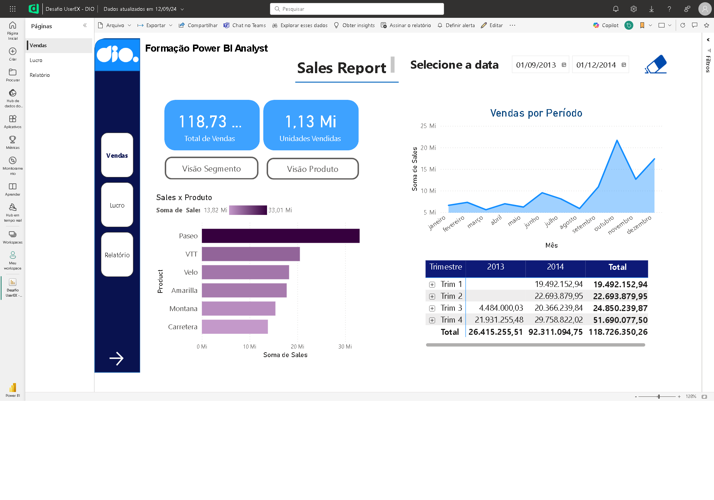
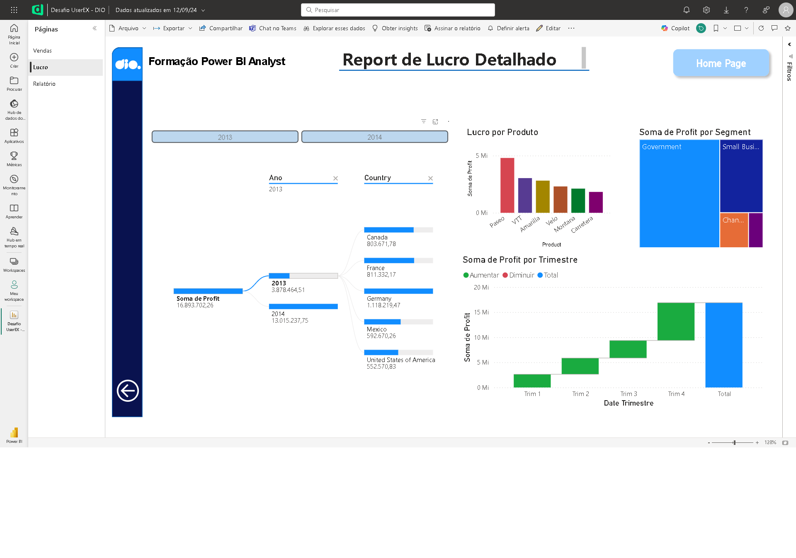
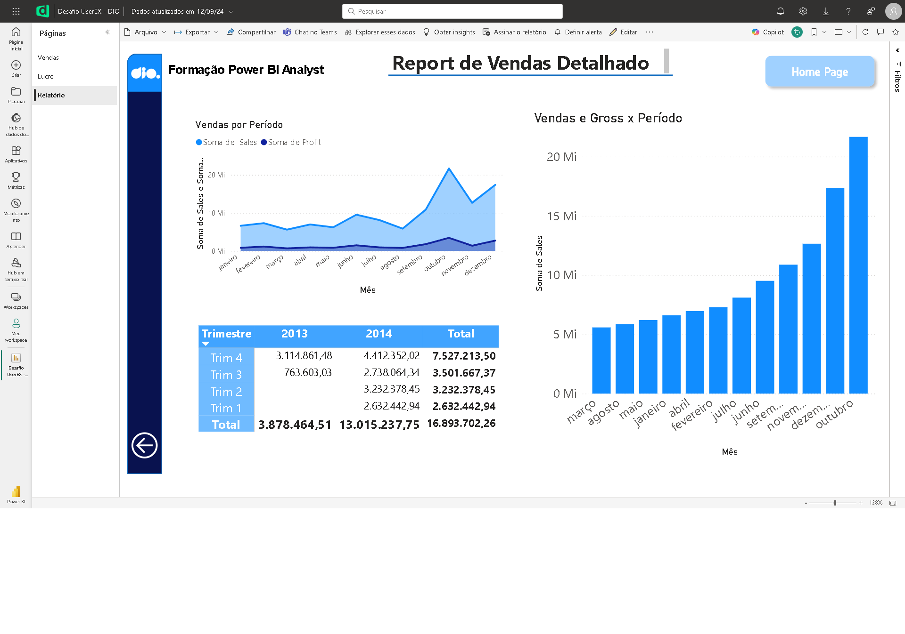

# Dashboard e Relatório - Sales Report

## 📒 Descrição
Evolução de um material construído utilizando Power BI, contendo boas práticas e princípios sobre uma melhor experiência do usuário. 
Demonstra algumas informações extraídas de um dataset de exemplo disponibilizado pela própria plataforma.
As informações são sobre vendas e lucros obtidos sobre principais produtos vendidos em diversas regiões geográficas, em um determinado período de tempo.
**Acrescentada página com visuais sobre vendas por período, soma de vendas e soma de lucros.**

## 🔎 Saiba Mais
- Material desenvolvido com o objetivo de concluir um desafio na plataforma de estudos [dio.me](https://web.dio.me)
- Não contém layout para display mobile.

## 💻 Ferramentas utilizadas
- [Power BI Desktop](https://www.microsoft.com/pt-br/download/details.aspx?id=58494) - Para utilização do dataset e criação do dashboard
- [Power BI Service](https://app.powerbi.com/) - Para publicação do material final

## ✨ Features
- Primeira página contendo visuais sobre vendas por segmento, produtos e países
- Diversos botões interativos para alterar determinados visuais nos espaços de vendas por segmento e por período
- Botão para resetar as datas selecionadas anteriormente
- Botões para alternar entre todas as páginas existentes
- Segunda página contendo visuais sobre lucros por segmento e produto em determinados trimestres, anos e países.
- Botão para retornar à página anterior
- Terceira página contendo visuais sobre vendas por período (mês e trimestre) e soma de vendas e some de lucros.
- Botão para retornar à página anterior
- Botão de "Home Page" para retornar à primeira página do relatório.

## 📚 Referências
- [GitHub Juliana Mascarenhas](https://github.com/julianazanelatto) - Para obtenção de outros dataset para fins didáticos.
