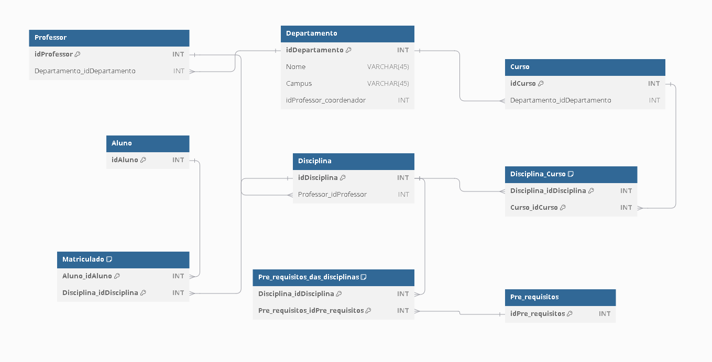

# Star Scheme - Código e Diagrama

## 📒 Descrição
Código utilizando SQL e seu consequente diagrama

 - [Código](assets/documents/star-scheme.sql)

 ```
CREATE TABLE Departamento (
    idDepartamento INT PRIMARY KEY,
    Nome VARCHAR(45),
    Campus VARCHAR(45),
    idProfessor_coordenador INT
);

CREATE TABLE Professor (
    idProfessor INT PRIMARY KEY,
    Departamento_idDepartamento INT,
    FOREIGN KEY (Departamento_idDepartamento) REFERENCES Departamento(idDepartamento)
);

CREATE TABLE Aluno (
    idAluno INT PRIMARY KEY
);

CREATE TABLE Curso (
    idCurso INT PRIMARY KEY,
    Departamento_idDepartamento INT,
    FOREIGN KEY (Departamento_idDepartamento) REFERENCES Departamento(idDepartamento)
);

CREATE TABLE Disciplina (
    idDisciplina INT PRIMARY KEY,
    Professor_idProfessor INT,
    FOREIGN KEY (Professor_idProfessor) REFERENCES Professor(idProfessor)
);

CREATE TABLE Disciplina_Curso (
    Disciplina_idDisciplina INT,
    Curso_idCurso INT,
    PRIMARY KEY (Disciplina_idDisciplina, Curso_idCurso),
    FOREIGN KEY (Disciplina_idDisciplina) REFERENCES Disciplina(idDisciplina),
    FOREIGN KEY (Curso_idCurso) REFERENCES Curso(idCurso)
);

CREATE TABLE Matriculado (
    Aluno_idAluno INT,
    Disciplina_idDisciplina INT,
    PRIMARY KEY (Aluno_idAluno, Disciplina_idDisciplina),
    FOREIGN KEY (Aluno_idAluno) REFERENCES Aluno(idAluno),
    FOREIGN KEY (Disciplina_idDisciplina) REFERENCES Disciplina(idDisciplina)
);

CREATE TABLE Pre_requisitos (
    idPre_requisitos INT PRIMARY KEY
);

CREATE TABLE Pre_requisitos_das_disciplinas (
    Disciplina_idDisciplina INT,
    Pre_requisitos_idPre_requisitos INT,
    PRIMARY KEY (Disciplina_idDisciplina, Pre_requisitos_idPre_requisitos),
    FOREIGN KEY (Disciplina_idDisciplina) REFERENCES Disciplina(idDisciplina),
    FOREIGN KEY (Pre_requisitos_idPre_requisitos) REFERENCES Pre_requisitos(idPre_requisitos)
);
 ```

 - [Diagrama](assets/images/print-starScheme.png)


## 🔎 Saiba Mais
- Material desenvolvido com o objetivo de concluir um desafio na plataforma de estudos [dio.me](https://web.dio.me)

## 💻 Ferramentas utilizadas
- [MySQL](https://www.mysql.com/) - Para desenvolvimento do código e criação do diagrama
- [dbdiagram](https://dbdiagram.io/) - Solução alternativa para desenvolvimento do código e criação do diagrama (online - não necessita instalação)

## 📚 Referências
- [GitHub Juliana Mascarenhas](https://github.com/julianazanelatto) - Para obtenção de outros dataset para fins didáticos.