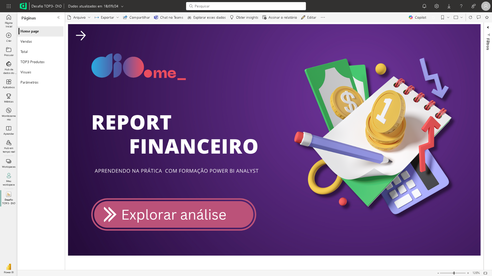
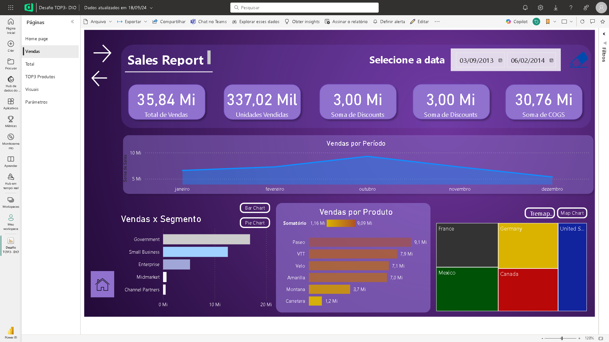
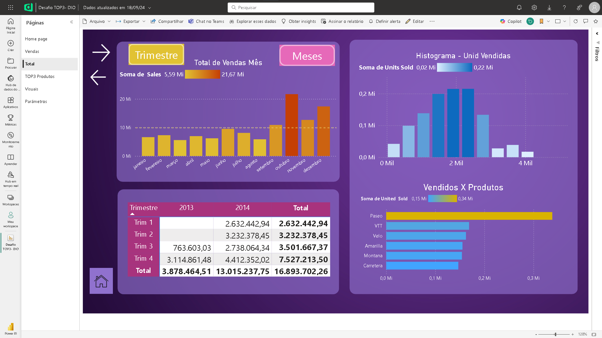
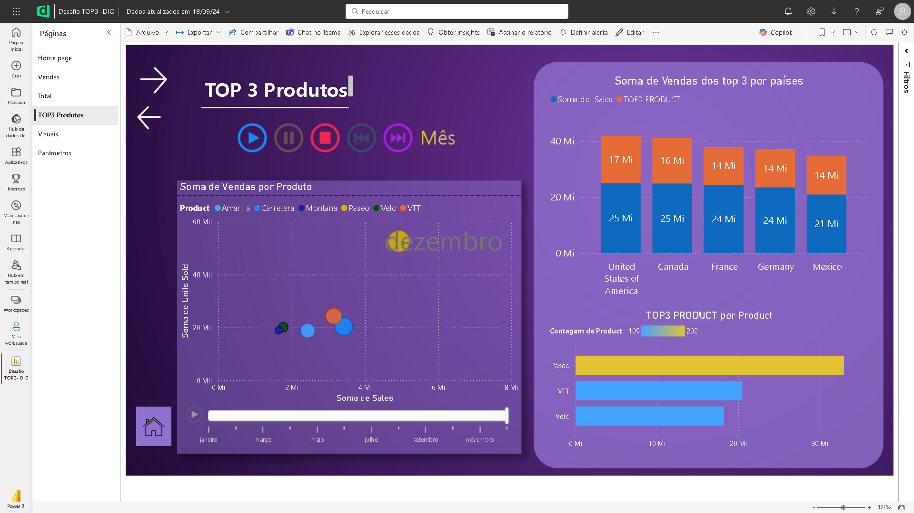
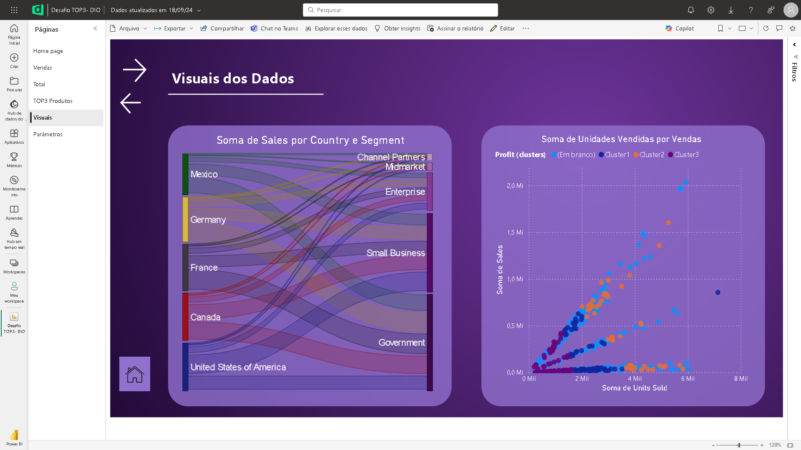

# Dashboard e Relatório - Sales and Profit Report (TOP 3 Products)

## 📒 Descrição
Evolução de um material construído utilizando Power BI, com reestilização das páginas anteriormente construídas, somado com a inserção de valores filtrados pelas maiores vendas.
Demonstra algumas informações extraídas de um dataset de exemplo disponibilizado pela própria plataforma.
As informações são sobre vendas e lucros obtidos sobre principais produtos vendidos em diversas regiões geográficas, em um determinado período de tempo. 
**Acrescentada páginas com visuais sobre vendas por período, histograma de unidades vendidas, soma de vendas por produto (TOP 3)**

## 🔎 Saiba Mais
- Material desenvolvido com o objetivo de concluir um desafio na plataforma de estudos [dio.me](https://web.dio.me)
- Não contém layout para display mobile.

## 💻 Ferramentas utilizadas
- [Power BI Desktop](https://www.microsoft.com/pt-br/download/details.aspx?id=58494) - Para utilização do dataset e criação do dashboard
- [Power BI Service](https://app.powerbi.com/) - Para publicação do material final
- [Canva](https://www.canva.com/) - Para criação de um novo visual para o início do relatório

## ✨ Features
- Primeira página com um novo visual, modelado utilizando a ferramenta Canva
- Segunda página contendo visuais sobre vendas por segmento, produtos e países
  - Diversos botões interativos para alterar determinados visuais nos espaços de vendas por segmento e por país
  - Botão para resetar as datas selecionadas anteriormente

- Terceira página contendo visuais sobre vendas por período (trimestres e meses), total de unidades vendidas por produto e um histograma de unidades vendidas.
  - Botões interativos para alterar determinados visuais nos espaços de vendas por período (trimestres e meses)
  
- Quarta página contendo visuais sobre soma de vendas por produto ao longo do ano e soma de venda do top 3 produtos por país
  - Lista de botões para iniciar, pausar, interromper e alterar período da animação de vendas por mês ao longo do ano.

- Quinta página contendo visuais sobre soma de vendas por país e segmento, além de Lucro por soma de Vendas.

- Botões para avançar para a próxima página
- Botões para retornar à página anterior
- Botão de "Home Page" para retornar à primeira página do relatório.

## 📚 Referências
- [GitHub Juliana Mascarenhas](https://github.com/julianazanelatto) - Para obtenção de outros dataset para fins didáticos.